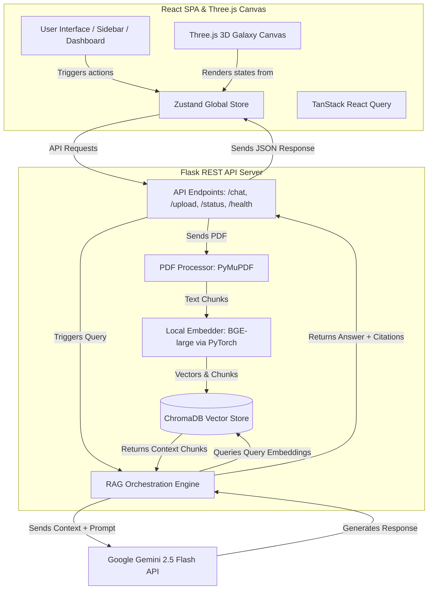

# Project Overview: Local RAG (Retrieval-Augmented Generation) Pipeline

This document provides a comprehensive technical overview of your **Retrieval-Augmented Generation (RAG) Pipeline** designed for local PDF ingestion and interactive analysis. It outlines the architecture, explains the capabilities of each library, traces the runtime data flows, and highlights the constraints and disadvantages of running this system in a local environment.

---

## 1. System Architecture

The project is structured as a decoupled web application with a high-performance, responsive React SPA (Single Page Application) frontend and a Python Flask microservice backend.



### Key Components:
1. **Frontend Interface (SPA)**: Interactive developer dashboard, sidebar navigation, custom chat stream, and settings configuration panel.
2. **3D WebGL Canvas**: Immersive Three.js visualization that renders the multi-dimensional vector space (embedding particles) and highlights retrieved text nodes in real-time.
3. **Backend Service Container**: Microservice bootstrapping local components (text extractor, local embedding generator, local vector database) and orchestrating data transactions.
4. **External LLM Gate**: Seamless calling interface to Google’s Gemini API using the latest SDK.

---

## 2. Library Index: What Each Library Does

### A. Backend Dependencies (`requirements.txt`)

*   **`flask` (v3.0.3)**: A lightweight WSGI web framework. It handles the RESTful routes (`/api/upload`, `/api/chat`, `/api/status`, `/api/health`, `/api/clear`) and coordinates request/response serialization.
*   **`flask-cors` (v4.0.1)**: Enables Cross-Origin Resource Sharing. This allows the frontend (running on Vite’s local port) to securely communicate with the Flask API (running on port 5000).
*   **`pymupdf` (v1.24.9 — `fitz`)**: An extremely fast PDF parser. It reads document binaries page-by-page, extracts raw text, filters layout properties, and handles character encodings.
*   **`sentence-transformers` (v3.0.1)**: A Hugging Face utility used to run embedding models locally. It handles tokenization and executes mathematical operations to convert text sentences into numerical vectors.
*   **`torch` (v2.3.1)**: PyTorch (installed as a CPU-only build in requirements). It is the underlying deep learning tensor library required by `sentence-transformers` to compute vector coordinates.
*   **`transformers` (v4.43.3)**: Hugging Face’s core transformers library. It provides configuration wrappers, cache managers, and architecture loaders for the embedding model.
*   **`numpy` (v1.26.4)**: A high-performance numerical computing library. It handles matrices and arrays returned by PyTorch and computes list-to-vector translations.
*   **`chromadb` (>=0.5.0)**: An open-source vector database. It stores the document chunks, their pre-computed embedding vectors, and associated metadata (e.g., page numbers). It performs high-speed similarity searches using Hierarchical Navigable Small World (HNSW) graphs.
*   **`google-genai` (v0.8.0)**: Google's official modern Python SDK for interacting with Gemini models. It handles credentials, connection pools, and structured payload generation for the Gemini API.
*   **`werkzeug` (v3.0.3)**: A utility toolkit bundled with Flask. It is used to sanitize filenames (`secure_filename`) before saving files to the disk to prevent directory traversal exploits.

### B. Frontend Dependencies (`package.json`)

*   **`react` & `react-dom` (v19.2.6)**: The core UI library used to build the single-page application.
*   **`vite` (v8.0.12)**: The modern build system and local dev server. It compiles TypeScript, optimizes imports, and reloads changes instantly during development.
*   **`three` (v0.184.0)**: The core 3D library used to render interactive WebGL scenes in the browser.
*   **`@react-three/fiber` (v9.6.1)**: A React wrapper for Three.js. It lets you write 3D components declaratively using JSX structure.
*   **`@react-three/drei` (v10.7.7)**: A collection of useful helpers and pre-made objects for React Three Fiber (like `OrbitControls`, `Points`, and `Line`).
*   **`zustand` (v5.0.14)**: A lightweight global state manager. It acts as the central hub for the frontend, storing chat history, upload status, latest queries, latency records, and UI tabs.
*   **`framer-motion` (v12.40.0)**: A React animation library used for smooth dashboard transitions, sidebar expansions, and micro-interactions.
*   **`lucide-react` (v1.17.0)**: A library of clean, vector-based SVG icons used throughout the interface.
*   **`@tailwindcss/vite` & `tailwindcss` (v4.3.0)**: A utility-first CSS framework used to design the premium, glassmorphism-based UI layout.
*   **`@tanstack/react-query` (v5.101.0)**: An async data-fetching and synchronization library, used to handle API hooks.
*   **`tailwind-merge` & `clsx`**: Utilities used to combine Tailwind class names dynamically without style conflicts.

---

## 3. Project File Structure & Code Responsibilities

Here is how the project files are organized:

```
RAGPipeline/
│
├── run.py                 # Application entrypoint; configures logging & starts Flask server
├── setup.bat              # Batch script to install dependencies and configure local environment
├── start.bat              # Batch script to launch backend and frontend concurrently
├── requirements.txt       # List of backend Python dependencies
│
├── app/                   # Backend application core
│   ├── __init__.py        # Flask app factory, configures CORS and registers routes
│   ├── config.py          # Central settings (API keys, models, chunk sizes, thresholds)
│   │
│   ├── routes/            # API Route definitions
│   │   ├── chat.py        # Endpoints: /chat (RAG query), /health, /clear (clear history)
│   │   └── upload.py      # Endpoints: /upload (PDF ingestion trigger), /status (polling)
│   │
│   ├── services/          # Business logic & external service connectors
│   │   ├── __init__.py    # Bootstraps singletons (Embedder, VectorStore, RAGEngine)
│   │   ├── embedder.py    # Local BGE embedding generator wrapper (SentenceTransformers)
│   │   ├── pdf_processor.py # PDF text extraction and sliding-window text chunker (PyMuPDF)
│   │   ├── vector_store.py  # Local ChromaDB operations wrapper (Persistent DB client)
│   │   └── rag_engine.py  # Core RAG logic, query routing, memory history, & Gemini SDK calls
│   │
│   └── utils/
│       └── helpers.py     # File validation and path traversal sanitization helpers
│
└── frontend/              # Frontend React application core
    ├── package.json       # Frontend package configuration and scripts
    ├── tsconfig.json      # TypeScript compiler settings
    ├── vite.config.ts     # Vite bundler options
    │
    └── src/
        ├── main.tsx       # SPA mount point
        ├── index.css      # Core styles and custom scrollbar animations
        ├── App.tsx        # Outer application wrapper, sidebar frame, and tab router
        ├── store.ts       # Zustand store managing state, API polling, and local storage
        │
        └── components/    # Reusable UI dashboard panels
            ├── ChatInterface.tsx      # Main conversation stream with latency badges
            ├── DocumentAnalytics.tsx  # Latency charts, model details, and metrics
            ├── HeroDashboard.tsx      # Welcome layout, system status, and user manuals
            ├── Layout.tsx             # Responsive grid containers
            ├── PromptInspector.tsx    # Live prompt debugger (developer view)
            ├── RetrievalInspector.tsx # Raw text chunks and similarity score inspector
            ├── SettingsView.tsx       # Sliding knobs for threshold, top_k, temperature
            ├── Sidebar.tsx            # Left-hand navigation navigation panel
            └── ThreeVisualization.tsx # 3D Galaxy Canvas and active pipeline flow
```

---

## 4. Run-Time Data Flows

### A. Document Ingestion Flow (Uploading a PDF)
1. **User Action**: The user drops a PDF file (e.g., `NVIDIA 2025 Annual Report`) into the upload drop-zone.
2. **Upload Route** (`app/routes/upload.py`):
    *   Flask receives the file payload via `POST /api/upload`.
    *   The file is sanitized and saved to the `uploads/` directory.
    *   A background thread (`_run_ingestion`) is spawned to prevent locking the main thread.
    *   A response is returned immediately to the frontend with code `202 Accepted`.
3. **Background Process**:
    *   **Text Extraction** (`pdf_processor.py`): PyMuPDF opens the PDF and extracts raw text page-by-page. It applies cleaning rules (removing unicode artifacts, normalizing quotes, and collapsing excessive whitespace).
    *   **Text Chunking** (`pdf_processor.py`): The cleaned text is broken down using a sliding window. By default, it generates overlapping chunks of **800 characters** with an overlap of **80 characters** to ensure context isn't lost at boundaries.
    *   **Embedding Generation** (`embedder.py`): The chunks are sent in batches (default: 32) to the local `BAAI/bge-large-en-v1.5` model. This model converts each text chunk into a **1024-dimensional float vector**.
    *   **Vector Storage** (`vector_store.py`): The local ChromaDB instance is cleared of old data. The new text chunks, their 1024-dimensional vectors, and page metadata are upserted into the persistent database collection.
    *   **Status Update**: Throughout this process, global progress variables are updated. The frontend polls `GET /api/status` every 800ms to display progress bar updates in real-time.

---

### B. Chat & Query Retrieval Flow (Asking a Question)
1. **User Action**: The user types a query (e.g., *"What was NVIDIA's revenue in FY25?"*) and hits send.
2. **Frontend Dispatch**:
    *   Zustand (`store.ts`) appends the query to `chatHistory` with a user role.
    *   A POST request is sent to `POST /api/chat` containing the message text and `session_id`.
3. **Query Vectorization** (`rag_engine.py` & `embedder.py`):
    *   The RAG Engine receives the message and passes it to the local Embedder.
    *   The Embedder prepends the BGE query prefix: *"Represent this sentence for searching relevant passages: "* and computes the vector embedding for the query.
4. **Vector Similarity Search** (`vector_store.py`):
    *   The query vector is sent to the local ChromaDB database.
    *   ChromaDB uses cosine similarity distance to find the **Top-6 (Top-K)** closest text chunks.
5. **Relevance Gating** (`rag_engine.py`):
    *   The engine checks the cosine distance of the best-matching chunk against a threshold (default: `0.35`).
    *   **RAG Mode (Distance < 0.35)**: A strong semantic match is found. The engine compiles the retrieved text chunks and page numbers into a structured context template.
    *   **General Mode (Distance >= 0.35 or DB empty)**: No relevant chunks are found. The engine decides to skip the PDF context and answers using the model's general knowledge (e.g., general greetings).
6. **Prompt Assembly & LLM Generation** (`rag_engine.py`):
    *   The engine builds a prompt combining the retrieved context (if in RAG mode), the conversation history (last 10 turns), and the user's question.
    *   The assembled payload is sent to the **Gemini 2.5 Flash API** using the Google GenAI SDK.
    *   Gemini generates a response restricted strictly to the provided context.
7. **Response & Rendering**:
    *   The response, active mode (rag/general), session ID, and citation sources (page numbers and text excerpts) are returned to the frontend.
    *   The frontend stores the response, calculates latency, updates the performance graphs, and highlights the retrieved nodes in the 3D galaxy visualization.

---

## 5. Local Disadvantages & Constraints (No Deployment Factors)

Running a complex RAG system entirely on a local machine introduces several resource, processing, and architecture disadvantages:

### 1. High Local CPU Latency & Resource Spikes
*   **The Issue**: The embedding model runs locally. Because the project's default setup uses the standard PyTorch CPU package, the machine must use raw CPU threads to compute vector embeddings.
*   **Impact**:
    *   During ingestion, CPU usage will spike to 100%, causing the computer to run slow or freeze momentarily.
    *   Processing a long PDF (like the 181-page NVIDIA report, producing ~1000 chunks) on a standard CPU can take **several minutes**.
    *   *Workaround*: Resolving this requires a GPU with CUDA support and swapping out the default PyTorch package for a GPU-optimized version (`torch+cu121`).

### 2. Large Initial Download & Cache Overhead
*   **The Issue**: The local embedding model (`BAAI/bge-large-en-v1.5`) is not pre-packaged. On the very first run, the app automatically downloads it from Hugging Face.
*   **Impact**:
    *   The download is **~1.34 GB**. This requires a stable, fast internet connection on the first run, or the server boot will time out.
    *   It permanently consumes 1.3+ GB of local disk space in the user's Hugging Face cache folder (`~/.cache/huggingface`).

### 3. In-Memory Chat Session Volatility (No Persistence)
*   **The Issue**: The backend session state (`self._sessions` inside `RAGEngine`) is stored entirely in the computer's volatile RAM.
*   **Impact**:
    *   If you stop the backend, restart the server, or the process crashes, **all active chat conversations and histories are deleted instantly**.
    *   There is no database persistence layer (like SQLite or PostgreSQL) to save user sessions across restarts.

### 4. Database Locking & SQLite Bottlenecks
*   **The Issue**: ChromaDB runs as a local file-based persistent database inside the `chroma_store` folder, which relies on SQLite.
*   **Impact**:
    *   SQLite locks files during write operations. If you attempt to upload another document in parallel or have multiple local server processes running, you will hit database write lock errors.
    *   If the database files become corrupted due to an unhandled crash or power loss during ingestion, the database must be deleted and re-indexed manually.

### 5. Ingestion Blocks Server Threading (GIL Bottleneck)
*   **The Issue**: Flask handles file uploads on a standard background thread (`threading.Thread`). However, because of Python's Global Interpreter Lock (GIL), CPU-heavy tasks (like generating embeddings with PyTorch) will block the execution of other threads in the same process.
*   **Impact**:
    *   While the backend is generating embeddings, the main thread may become unresponsive. The frontend's polling requests (`GET /api/status`) may hang or time out until the embedding process is complete.

### 6. Simple Chunker Content Fragmentation
*   **The Issue**: The project uses a simple, character-count sliding window (`pdf_processor.py`) rather than layout-aware or semantic chunking.
*   **Impact**:
    *   **Broken Tables**: Financial tables, grids, and lists are split mid-row if they fall on a chunk boundary, causing the numbers to lose context and leading to hallucinated or inaccurate responses from the LLM.
    *   **Fragmented Sentences**: Sentences are cut in half at chunk boundaries, which can lower the vector similarity match score and result in relevant passages being missed.

### 7. Single Document Knowledge Limit (Override Mode)
*   **The Issue**: The ingestion pipeline resets the database (`vector_store.reset()`) on every new upload.
*   **Impact**:
    *   The database is restricted to holding **one document at a time**. You cannot upload multiple PDFs to build a shared knowledge base; uploading a new file automatically erases the previous one.
